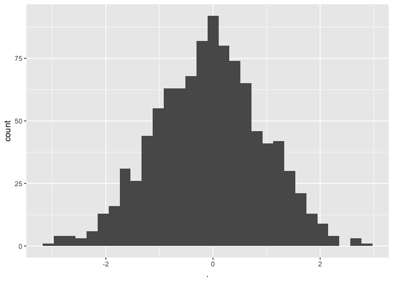

testScript.R
================
black
Fri Feb 9 12:25:58 2018

``` r
library(magrittr)
library(ggplot2)

x <- rnorm(1000)

x %>% as.data.frame() %>%
  ggplot(., aes(x=.)) + geom_histogram()
```

    ## `stat_bin()` using `bins = 30`. Pick better value with `binwidth`.


